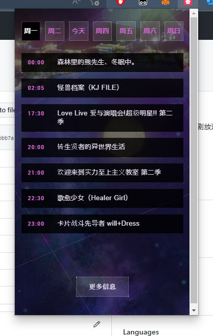
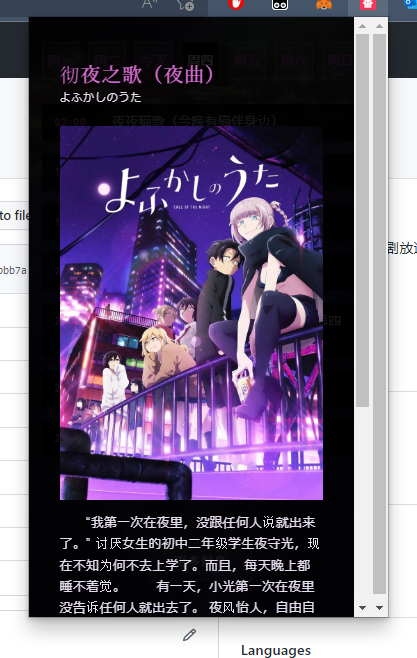

# Anime-List-Crx

这是一个番剧放送表 浏览器插件,为了更加便利的查看番剧更新时间

番剧数据等来自 https://github.com/AzumWatson/anime-data

前端页面参考 『[よふかしのうた](https://yofukashi-no-uta.com/)』 (彻夜之歌) TV 的官网 (因为我不会写css)

## 如何使用

直接下载压缩包,或者前往 [Releases](https://github.com/AzumWatson/Anime-list-crx/releases) 页面下载(如果我有传的话)

压缩包下载完成之后 找个合适的文件夹解压,然后打开你的浏览器 Edge 或者 Chrome (其他浏览器没有试过),进入到拓展页面 开启开发者模式,选择加载以解压的拓展选择解压的那个文件夹

就完成了 是不是很简单！

## 插件预览图

## 代办

可能后续会进行UI重构吧,或许